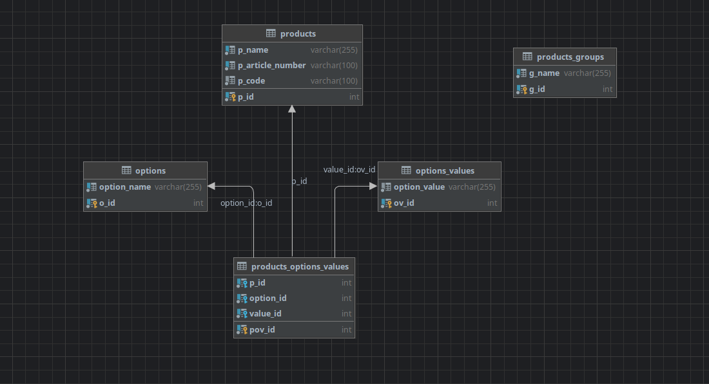
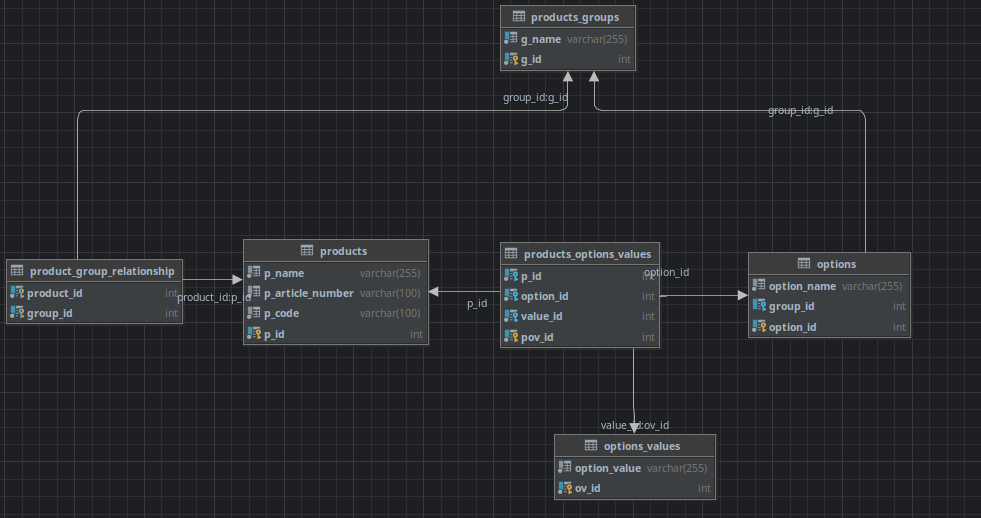

### Схема здесь такая:

### Здесь возможно удобней будет так:

Возможно тут появляется некоторая избыточность в хранении опций, 
думаю это можнно решить связью многие ко многим,
но зависит от случая использования, в целом идея думаю понятна.